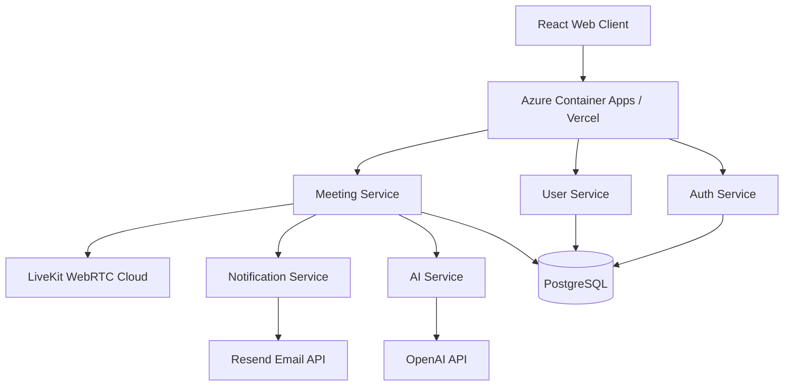

<div align="center">
  <h1>Vaarta</h1>
  <p><strong>Enterprise-grade, AI-native Web Conferencing Platform</strong></p>

  [](https://reactjs.org/)
  [](https://spring.io/projects/spring-boot)
  [](https://livekit.io/)
  [](https://azure.microsoft.com/)
  [](https://opensource.org/licenses/MIT)

  <p>
    <a href="#features">Features</a> •
    <a href="#architecture">Architecture</a> •
    <a href="#tech-stack">Tech Stack</a> •
    <a href="#getting-started">Getting Started</a> •
    <a href="#deployment">Deployment</a>
  </p>
</div>

---

## 🚀 Overview

**Vaarta** is a modern, highly scalable video conferencing platform designed to bridge the gap between simple video calls and enterprise-grade meeting intelligence. Built on a resilient **microservice architecture** utilizing **Spring Boot** and **React**, it offers crystal-clear WebRTC video (via LiveKit), seamless authentication, dynamic AI capabilities, and real-time meeting notifications.

---

## ✨ Features

- **🎥 Ultra-Low Latency Video & Audio**: Powered by LiveKit for enterprise-grade WebRTC performance.
- **🔐 Secure Authentication & Secrets**: JWT-based secure authentication, with credentials safely managed via **Azure Key Vault**.
- **⚡ Instant & Scheduled Meetings**: Launch instant rooms or schedule upcoming team syncs with real-time dynamic dashboard notifications.
- **📩 Smart Invites**: Invite participants directly via email with seamless background integration using Resend.
- **🤖 AI Integration**: Foundation built to seamlessly inject AI agents for transcription, summarization, and sentiment tracking.
- **☁️ Cloud-Native Scalability**: Fully containerized architecture capable of scaling to zero to optimize costs.
- **🚀 Automated CI/CD**: Automated deployment pipelines using **GitHub Actions** for seamless continuous integration and continuous deployment to Azure.
- **📊 Centralized Logging & Telemetry**: Integrated with **Azure Application Insights** for comprehensive application monitoring and distributed tracing.
- **⚡ High-Performance Caching**: Utilizes **Azure Cache for Redis** to instantly serve guest join sessions and dramatically reduce database loads.

---

## 🏗️ Architecture

Vaarta embraces a highly decoupled, monolithic-repo microservice architecture. 



### Microservices
| Service | Responsibility | Port (Local) |
|---|---|---|
| **`auth-service`** | JWT generation, Registration, Login | `8081` |
| **`user-service`** | Profile management, User data | `8082` |
| **`meeting-service`** | Meeting state, LiveKit tokens, Invites | `8083` |
| **`notification-service`** | Background email delivery (Resend) | `8084` |
| **`ai-service`** | Python backend for AI agent processing | `8000` |

---

## 💻 Tech Stack

- **Frontend**: React 18, TypeScript, Vite, Tailwind CSS, shadcn/ui, Zustand
- **Backend**: Java 17, Spring Boot 3, Spring Security, Spring Data JPA
- **Database & Caching**: PostgreSQL with Flyway Migrations, Azure Cache for Redis
- **Real-time Video**: LiveKit SDKs
- **AI / ML**: Python, FastAPI, OpenAI
- **Infrastructure & DevOps**: Docker, Azure Container Apps, Vercel, GitHub Actions CI/CD
- **Security & Monitoring**: Azure Key Vault, Azure Application Insights

---

## 🛠️ Getting Started (Local Development)

### Prerequisites
- Java 17+
- Node.js 18+
- Docker & Docker Compose
- LiveKit Cloud Account (or local LiveKit server)

### 1. Spin up the Database
Start the local PostgreSQL database using Docker Compose:
```bash
docker-compose up -d
```

### 2. Start the Backend Services
Navigate into any of the backend service directories (e.g., `meeting-service`) and run the Spring Boot application:
```bash
cd meeting-service
./mvnw spring-boot:run
```
*(Repeat for `auth-service`, `user-service`, and `notification-service`)*

### 3. Start the Frontend
Install dependencies and run the Vite dev server:
```bash
cd frontend
npm install
npm run dev
```
Open `http://localhost:5173` in your browser.

---

## 🌍 Cloud Deployment

Vaarta is optimized for **Azure Container Apps** for the backend and **Vercel** for the frontend, ensuring minimal cost and maximal scale. 

For a complete, step-by-step production deployment guide, refer to the local `AzureDeployment.md` file located in the root of the repository.

### Key Deployment Features:
- **Serverless Containers**: Backend services scale to zero when inactive.
- **Edge CDN**: React frontend deployed globally via Vercel.
- **Managed Database**: Azure PostgreSQL Flexible Server.

---

## 📜 License

This project is licensed under the MIT License. See the [LICENSE](LICENSE) file for details.

---
<div align="center">
  <i>Built with ❤️ by the Vaarta Team.</i>
</div>
